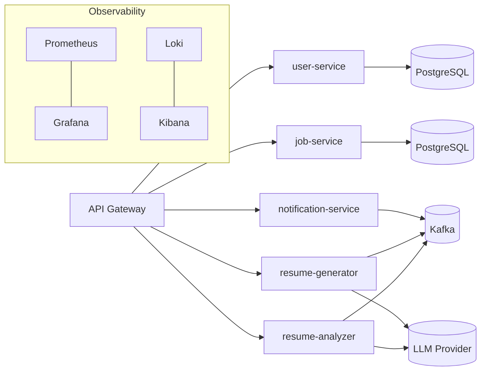

# ARCHITECTURE

Схема для **Hiring Portal**: стартуем монолитом → эволюция в микросервисы.  
Ниже две версии диаграмм: **Mermaid** (для GitLab/GitHub) и **ASCII** (видно прямо в редакторе).

---

## 1) System Context (Mermaid)

```mermaid
graph TD
    User[Кандидат] --- UI[Web UI / Mobile]
    Employer[Работодатель] --- UI

    subgraph Monolith["Hiring Portal (Монолит)"]
      Web[Web (REST/GraphQL)] --> Core[Core (Domain)]
      Core --> AI[AI (Resume Analyzer & Generator)]
      Core --> Persistence[Persistence]
      Core --> Shared[Shared Utils]
    end

    AI --> LLM["LLM Provider (OpenRouter/OpenAI/DeepSeek)"]
    Persistence --> PG[(PostgreSQL)]
    Persistence --> MG[(MongoDB)]
    Persistence --> RD[(Redis)]
    Monolith -.уведомления.-> Notif["Email/SMS Provider"]
    Admin[Админ] --- Web
```

### 1.1 System Context (ASCII)

```
[Кандидат]   [Работодатель]
     \\           //
           [ Web UI ]
                |
        +-------------------------+
        | Hiring Portal (Монолит) |
        |  Web -> Core -> (AI,    |
        |  Persistence)           |
        +-------------------------+
           |     |        |
          AI   БД/Кэш   Utils
           |     |        |
       [LLM]  [PG][MG][Redis]
                |
           [Email/SMS]
```

---

## 2) Внутренняя структура монолита (Mermaid)

```mermaid
flowchart LR
  subgraph MONO["Monolith"]
    WEB[web\n(Controllers, DTO, Security)]
    CORE[core\n(Доменные сущности, use-cases)]
    AI[ai\n(Analyzer/Generator, LLM Client)]
    PERS[persistence\n(Repositories, Migrations, JPA/R2DBC)]
    SHARED[shared\n(Common, errors, utils)]
  end

  WEB --> CORE
  CORE --> AI
  CORE --> PERS
  WEB --> SHARED
  CORE --> SHARED
  AI --> SHARED
  PERS --> SHARED

  PERS -->|JDBC/R2DBC| PG[(PostgreSQL)]
  PERS -->|Document| MG[(MongoDB)]
  PERS -->|Cache| RD[(Redis)]
  AI -->|HTTP| LLM[(LLM Provider)]
  WEB -->|Outbound| NOTIF[(Email/SMS)]
```

### 2.1 Внутренняя структура монолита (ASCII)

```
web  -->  core  -->  ai ----> [LLM]
  |        |        |
  |        +------> persistence --> [PG][MG][Redis]
  |                 |
  +----> shared <---+
  |
  +----> (Email/SMS provider)
```

Правила:
- `web` вызывает только `core`;
- доменная логика живёт в `core`;
- `persistence` — адаптеры/репозитории + миграции;
- `ai` — фасад к LLM и локальным правилам;
- `shared` — переиспользуемые компоненты.

---

## 3) Цель: микросервисы (Mermaid)



### 3.1 Цель: микросервисы (ASCII)

```
          [API Gateway]
      /      |        |       \
 user-svc  job-svc  resume-analyzer  resume-generator
    |         |            \             /
  [PG]      [PG]           [ Kafka bus ]        notification-svc
                                   |                   |
                                  [LLM]              (Email/SMS)
```

---

## 4) Типовые сценарии (монолит)

1) Создание резюме и анализ:
- `web` → `core.save(resume)` → `persistence` (PG)
- `core` → `ai.analyze(profile)` → LLM → рекомендации
- `web` → 201 Created + советы

2) Поиск и рекомендации:
- `web` → `core.search(criteria)` → БД (+ Redis кэш)
- `core` → `ai.match(resume, jobs)` → сортировка по score
- `web` → результаты

---

## 5) Минимальные соглашения

- Слои: `web` → `core` → (`ai` | `persistence`) → внешние ресурсы.
- DTO/Mapper — на границах `web`/`core`.
- Исключения: доменные → маппинг в HTTP-коды в `web`.
- Профили: `dev`, `test`, `prod`.
- Тесты: JUnit5, Testcontainers (PG/Redis).

---

## 6) Эволюция данных

- Монолит: одна БД (PostgreSQL), схемы: `users`, `jobs`, `resumes`, `analytics`.
- Микросервисы: разнос по БД/схемам, обмен доменными событиями через Kafka.
- Поиск вакансий: опционально Elasticsearch.

---

## 7) ADR (плейсхолдеры)

- ADR-001: Монолит как старт; стратегия декомпозиции.
- ADR-002: Выбор БД и кэша (PostgreSQL + Redis).
- ADR-003: Интеграция с LLM (провайдеры, ретраи, квоты, circuit breaker).
